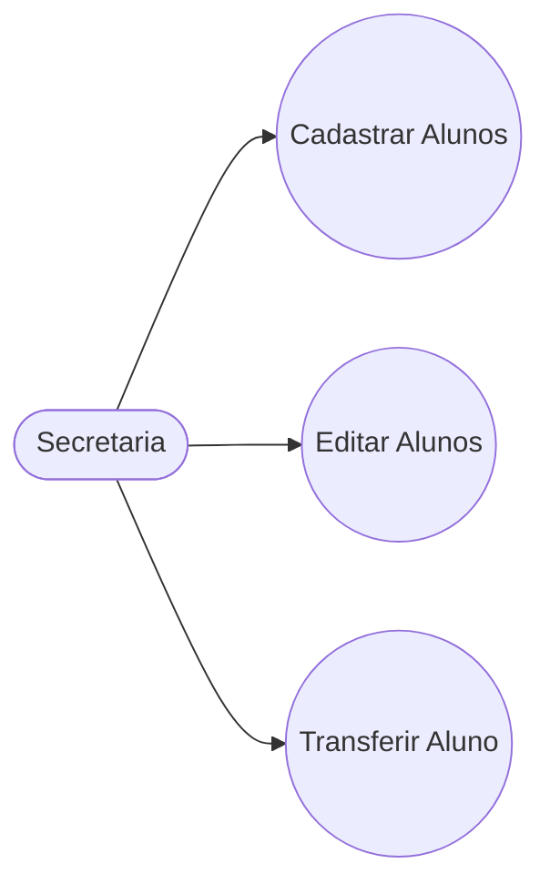
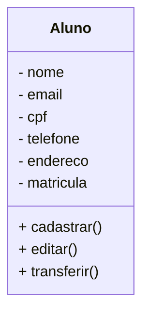

# Projeto Universidade

Modelagem em Orientação à Objetos das Entidades Alunos, Cursos e Turmas.

## Caso de Uso


## Diagrama de Classes



# Funções MySQL

- CREATE - Cria tabelas dentro da base de dados.
- INSERT - Cria registros dentro das tabelas.

- SELECT - Permite visualizar os dados dentro das tabelas. Também permite filtrar os dados que quer visualizar.

- ALTER - Altera a estrutura das tabelas, adicionando ou removendo atributos(campos).
- UPDATE - Atualiza regristros dentro da tabela.

- DROP - Exclui a tabela ou a base de dados inteira.
- DELETE - Exclui registros dentro das tabelas.

# MySQL

- Banco de Dados: Programa hospedado na máquina, com objetivo de persistir os dados fisicamente no HD.

- Base de Dados: Conjunto de tabelas.

- Tabelas: Conjunto de registros.

- Registros: Uma linha na tabela, contendo a informação dos seus atributos.

- Atributos: Uma das caracteristicas da tabela (Colunas).

## Bibliotecas Python

Este é um projeto desktop, utilizando as tecnologias:

- Python
- PySide6
- PyInstaller

## Dependências
- **VSCode**: IDE (Interface de Desenvolvimento)

- **Mermaid**: Linguagem para confecção de Diagramas em documentos MD (Mark Down)

- **Material Icon Theme**: Tema para colorir as pastas.

- **Git Lens**: Interface gráfica pra o versionamento .git integrada ao VSCode.

- **MySql**: SGBS (Sistema Gerenciador de Banco de Dados). Permite conctra o usuario com o servidor MySql, posibilitando criar bases de dados, tabelas, incluir e modificar atributos e registros.

## Build
- **dependencias**
~~pip install pyinstaller~~
```
pip install -r requirements.txt
```

**congelar dependencias**
```
pip freeze > requeriments.txt
```

**diretorio raiz do projeto:**Pasta python
```
cd python
```
```
pyinstaller --onefile --windowed app.py
```

**o executavel estara em:** dist/app.exe


