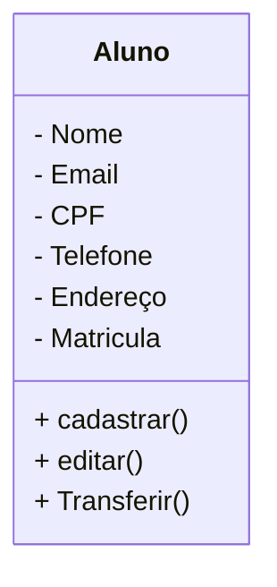

# Projeto universidade

Modelagem em Orientação á Objetos das Entidades Alunos, Cursos e turmas.

## Caso de uso

## Diagrama de Clases

## Transferencia
- **VSCode**: IDE(Interface de Desenvolvimento).

- **Mermaid**: Linguagem para confecção de Diagramas em documentos MD (Mark Down).

- **Git Lens**: Interface gráfica para o versionamento .git integrada ao VSCode.